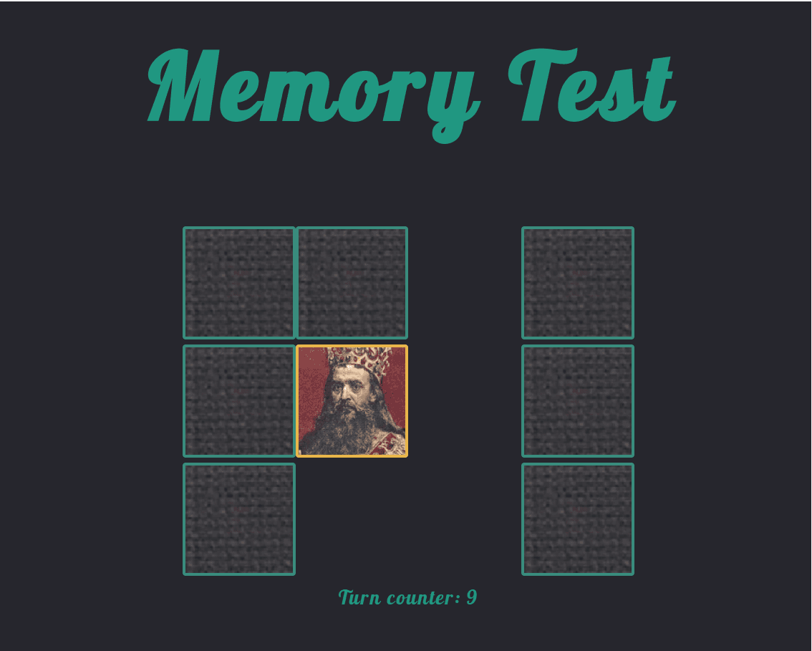

# Memory
Memory is a game to practice memory. User recovers tiles to see picture and his task is to recover second tile with the same picture. If he recoves the same, the recovered tiles are removed from the game, if tiles are not the same then they are covered and user has to try again. Each time when user recover the pairs of tiles, a turn counter is increasing by one.

# Features
User can use a mouse to click and recover the tiles
# Technologies
JavaScript + jQuery, Sass, HTML
# Supported Platforms
Google Chrome - version 73.0.3683.103 and higher  
Mozilla Firefox - version 66.0.3 and higher  
Chromium - version 71.0.3578.98 and higher  
Edge
# Supported Controllers
Mouse
# Use the app
https://jeraldstarr.github.io/Memory/
